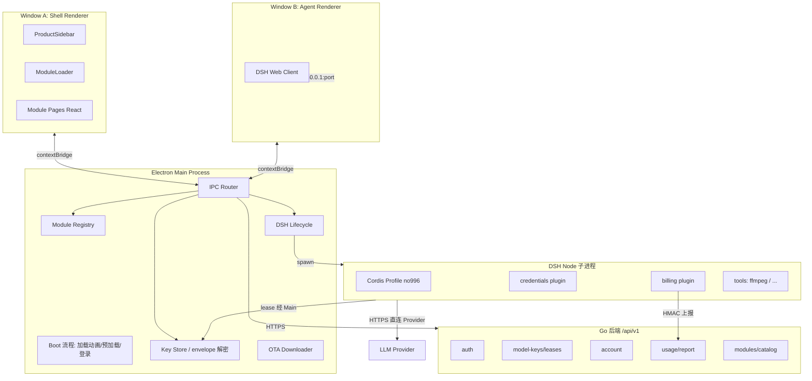
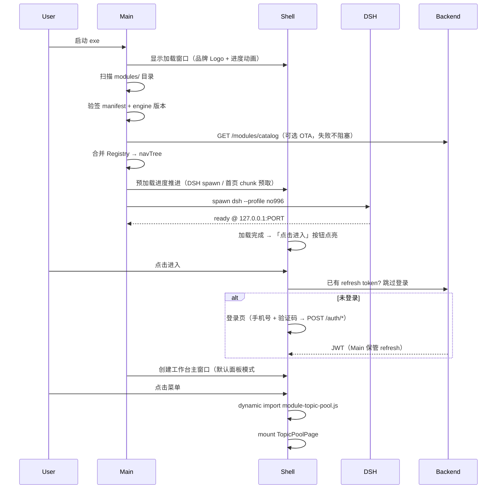
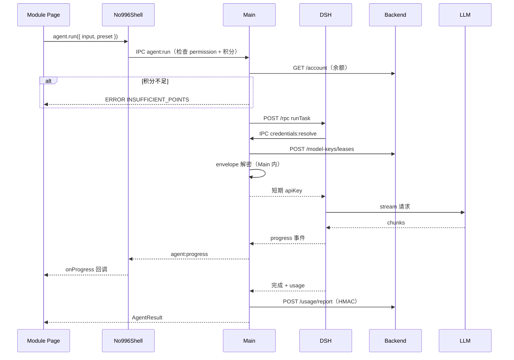
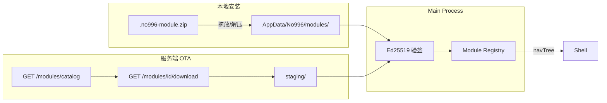

# 02 · 架构实现与调用链路

> 目标：用图和代码说清「谁调谁、数据怎么走、后续怎么扩展」。

---

## 1. 进程与窗口拓扑



---

## 2. 启动时序（加载动画 → 点击进入 → 登录 → 工作台）



**要点**：加载动画期间完成 Registry 扫描、验签、DSH 预热与首页 chunk 预取；任一步失败（如后端不可达）降级为可进入离线壳 + 明确错误提示，不白屏。启动只加载 **manifest 元数据**(约 2KB/Module),不加载页面 JS。首次运行从冷缓存读取约 100 个 manifest 的完整解析耗时待实测(文档 03 §3 基准脚本);按常规 JSON 解析速率估算低于 50ms,不应作为承诺值。

### 2.1 双模式视图切换（面板 / 智能工作台）

```text
ShellLayout
├── TopBar（新增）
│   ├── ModeSwitch: panel | agent
│   ├── 积分余额（GET /account，扣费展示位）
│   └── 用户菜单（设置入口）
├── panel 模式   → Sidebar + 当前 Module Page（交付包 12 页形态）
└── agent 模式   → AgentPanel：左侧仍为功能模块列表，
                   选中模块 → 右侧展示该模块的 AI 执行面板
                   （V1 骨架：引导文案 + 「去执行」跳对应 Module 页）
```

两种模式共用 Registry 与登录态；`agent` 模式 V1 只需保证：顶栏可切、Agent 窗口可唤起（`agent:open`）、每个功能模块有执行入口与说明文案。真实 AI 闭环按 Module 迁移进度逐页接入。

### 2.2 首页（`#overview`）双区结构

```text
┌──────────────────────────────┐
│  AI 对话框：「今天该干什么？」  │ ← shell.agent.open() / run()
│  AI 返回引导卡片 → 点击跳转    │ ← shell.nav.go('#topic-pool?...')
├──────────────────────────────┤
│  本周经营简报卡片区            │ ← 交付包 HomePage 已有交互
└──────────────────────────────┘
```

---

## 3. AI 任务调用时序（Module → Agent）



**密钥规则**:envelope 只在 **Main** 解密,Renderer / Module 永远拿不到 apiKey。lease 由 Main 侧守护:定时检查剩余有效期、到期前经 `credentials:resolve` 预刷新、退出时 `POST /model-keys/leases/release` 归还(运行时不重验签名,信任 Main 加载时的验签结果)。

**V1 范围**：时序图中的 `tool ffmpeg-cut` 步骤已 ❌ 划掉（短视频剪辑 ❌ **待讨论**，暂不排期）；V1 的 Agent 任务以文本/Prompt 类工具为主，扣费链路（余额检查 → lease → usage 上报）为 V1 必做。

---

## 4. Module 注册与路由（Registry 驱动）

### 4.1 Main 侧 Registry

```typescript
// apps/electron/src/main/module-registry.ts（示意）

interface ModuleRecord {
  id: string;
  version: string;
  manifest: ModuleManifest;
  rootPath: string;
  entryUrl: string;       // file://.../dist/index.js
  signatureValid: boolean;
  enabled: boolean;
}

class ModuleRegistry {
  private records = new Map<string, ModuleRecord>();

  async scanAndMerge(): Promise<NavTree> {
    await this.scanLocalDir(getModulesDir());
    await this.mergeOtaCatalog();   // 见 §7
    this.verifySignatures();
    return this.buildNavTree();
  }

  buildNavTree(): NavTree {
    return [...this.records.values()]
      .filter(r => r.enabled && r.signatureValid)
      .sort((a, b) => a.manifest.nav.order - b.manifest.nav.order)
      .reduce(groupByNavGroup, {});
  }
}
```

### 4.2 Shell 侧 Router（替代 main.tsx 硬编码）

```typescript
// apps/shell/src/App.tsx（示意）

function App() {
  const route = useHashRoute();
  const record = useRegistryMatch(route.hash);

  return (
    <ShellLayout sidebar={<ProductSidebar activeRoute={route.hash} />}>
      {!record ? (
        <NotFound />
      ) : (
        <Suspense fallback={<ModuleSkeleton />}>
          <LazyModule record={record} route={route} />
        </Suspense>
      )}
    </ShellLayout>
  );
}

function LazyModule({ record, route }: Props) {
  const Mod = useMemo(
    () => lazy(() => import(/* @vite-ignore */ record.entryUrl)),
    [record.entryUrl],
  );
  const shell = useShellBridge();
  return <Mod.Page shell={shell} route={route} params={route.params} />;
}
```

### 4.3 ProductSidebar（Registry 驱动）

```typescript
// apps/shell/src/ProductSidebar.tsx（示意）

function ProductSidebar({ activeRoute }: { activeRoute: string }) {
  const shell = useShellBridge();
  const { groups } = useNavRegistry();  // preload 注入，非 React context 跨域

  return (
    <aside className="app-sidebar">
      <BrandLockup />
      {groups.map(group => (
        <NavGroup key={group.id} group={group} activeRoute={activeRoute} />
      ))}
      <button onClick={() => shell.agent.open()}>打开 Agent</button>
    </aside>
  );
}
```

---

## 5. module.manifest.json 规范（V1）

```json
{
  "$schema": "https://no996.dev/schemas/module-manifest-v1.json",
  "id": "topic-pool",
  "version": "1.0.0",
  "name": "选题管理",
  "engine": { "shell": ">=1.0.0", "bridge": ">=1.0.0" },
  "nav": {
    "group": "content-growth",
    "groupLabel": "内容增长",
    "order": 40,
    "route": "#topic-pool",
    "icon": "calendar"
  },
  "entry": {
    "type": "react",
    "export": "./dist/index.js",
    "exportName": "TopicPoolModule"
  },
  "permissions": [
    "network:api.no996.dev",
    "filesystem:workspace:read",
    "filesystem:workspace:write",
    "agent:invoke"
  ],
  "agent": {
    "presets": ["content-planner"],
    "skills": ["topic-research"],
    "workbenchMode": {
      "agentPanel": {
        "title": "选题执行",
        "entryRoute": "#topic-pool?focus=pool",
        "description": "AI 从热点中筛选选题并加入排期"
      }
    }
  },
  "billing": { "unlockPoints": 0, "perRunPoints": 2 }
}
```

新增 `agent.workbenchMode` 可选字段：智能工作台模式（文档 02 §2.1）据它渲染每个功能模块的执行面板文案与跳转入口；未声明则该模块在 agent 模式下只显示名称与「打开页面」按钮。

> `video-clipper`（短视频剪辑）示例 manifest 已 ❌ 划掉（该 Module **待讨论**，暂不排期）；ffmpeg 相关 permission（`media:*`）、preset、tool 声明一并搁置，待讨论结论后再引入。

---

## 6. Shell Bridge API（V1 核心）

Module **唯一**允许使用的运行时 API：

```typescript
// packages/module-sdk/src/shell.ts

export interface No996Shell {
  auth: {
    getSession(): Promise<Session>;
    getAccessToken(): Promise<string>;
  };
  account: {
    getBalance(): Promise<{ points: number }>;
  };
  nav: {
    go(route: string): void;
  };
  agent: {
    open(opts?: { preset?: string; skill?: string }): Promise<void>;
    run(task: AgentTask): Promise<AgentResult>;
    onProgress(cb: (e: AgentProgress) => void): Unsubscribe;
    onResult(cb: (r: AgentResult) => void): Unsubscribe;
  };
  fs: {
    pickFile(opts?: PickFileOpts): Promise<string | null>;
    getWorkspaceRoot(): Promise<string>;
    readText(path: string): Promise<string>;
    writeText(path: string, content: string): Promise<void>;
  };
  media: {
    pickVideo(): Promise<string | null>;
    transcode(opts: TranscodeOpts): Promise<{ outputPath: string }>;
  };
  api: {
    get<T>(path: string): Promise<T>;
    post<T>(path: string, body: unknown): Promise<T>;
  };
  events: {
    emit(name: string, payload: unknown): void;
    on(name: string, cb: (p: unknown) => void): Unsubscribe;
  };
  module: { id: string; version: string };
}
```

### IPC 通道清单（Main ↔ Renderer）

| 通道 | 方向 | 说明 |
|------|------|------|
| `registry:get` | R→M | 获取 navTree + module 元数据 |
| `auth:session` | R→M | 读 session |
| `auth:token` | R→M | 短期 access token |
| `auth:login` | R→M | 登录页提交（手机号 + 验证码 → /auth/*） |
| `account:balance` | R→M | 积分余额 |
| `mode:switch` | R→M | 顶栏面板/智能工作台模式切换通知 |
| `agent:open` | R→M | 打开/focus Agent 窗口 |
| `agent:run` | R→M | 发起 Agent 任务 |
| `agent:progress` | M→R | 推送进度 |
| `agent:result` | M→R | 推送结果 |
| `fs:*` | R→M | 文件操作（permission 门控） |
| `media:transcode` | R→M | 转发 DSH/Main ffmpeg |
| `api:proxy` | R→M | 带 token 的后端代理 |
| `module:install` | R→M | 安装 zip |
| `module:reload` | M→R | Registry 热更新 |

---

## 7. Module 分发：本地 + OTA



### 本地路径

```text
Windows:  %APPDATA%/No996/modules/{id}@{version}/
macOS:    ~/Library/Application Support/No996/modules/
```

### OTA 后端接口（待实现）

```text
GET  /api/v1/modules/catalog           # 租户可见列表
GET  /api/v1/modules/{id}/manifest
GET  /api/v1/modules/{id}/download   # 短期签名 URL
POST /api/v1/modules/{id}/install      # 审计
```

**冲突策略**:同 id 同租户内取 semver 高者;官方 builtin(见文档 03 §12)始终优先于同 id 第三方分发。无有效签名拒绝加载(dev 可 `--allow-unsigned`)。上架安全网:OTA 包签发时锁定最低 Shell 版本,强制通过带 mock 后端的启动冒烟测试,单包一键回滚到上一版本号。

---

## 8. DSH Kernel 集成

### 8.1 Profile 叠层

```text
空 profile root
  → dsh-base          （model/tools/session/...）
  → dsh-web-app       （Web host + client 插件）
  → no996-bundle      （credentials/billing/tools/bridge-host）
  → 用户 cordis.patch.yml（高级用户，可选）
```

### 8.2 no996-bundle 插件清单

| 包 | ctx 贡献 | 职责 | V1/V2 |
|----|----------|------|-------|
| `no996-credentials` | `ctx.credentials` provider | lease → Main 解密 → resolve | V1 |
| `no996-billing` | hook llm/tool 完成 | canonical HMAC → `/usage/report` | V1 |
| `no996-bridge-host` | service | 接收 Main 转发的 agent:run | V1 |
| `no996-tool-ffmpeg` | `ctx.tools` | 剪切/合成（Node 子进程） | ❌ **待讨论**（随剪辑 Module，暂不排期） |
| `skill-filesystem` | `ctx.skills` | **保留**用户自装 Skill | V1 |

### 8.3 credentials 插件示意

```typescript
// packages/no996-dsh-bundle/credentials/src/index.ts（示意）

export function apply(ctx: Context) {
  ctx.credentials.registerProvider({
    id: 'no996-lease',
    async resolve(ref) {
      // 经 Unix socket / IPC 问 Main 拿短期 key（不在 DSH 进程解密）
      return mainClient.request('credentials:resolve', { ref });
    },
  });
}
```

### 8.4 Agent 独立窗口

```typescript
// apps/electron/src/main/windows/agent-window.ts（示意）

export function openAgentWindow(dshPort: number) {
  const win = new BrowserWindow({
    width: 960,
    height: 720,
    webPreferences: {
      preload: join(__dirname, 'agent-preload.js'),
      contextIsolation: true,
      nodeIntegration: false,
    },
  });
  win.loadURL(`http://127.0.0.1:${dshPort}/`);
  return win;
}
```

---

## 9. 扩展示例：智能工作台模式 Module 面板（V1 形态）

> 短视频剪辑示例已 ❌ 划掉（**待讨论**，暂不排期，见 §5 末尾说明）。此处以「选题管理」为例展示智能工作台模式下面板的落点；重 UI 深度集成（timeline 类组件、ffmpeg 执行链）同样 ❌ 待讨论。

### 9.1 目录

```text
modules/topic-pool/
├── module.manifest.json        # 含 agent.workbenchMode 面板声明
├── src/
│   ├── index.ts
│   └── pages/TopicPoolPage.tsx
└── package.json
```

### 9.2 智能工作台面板：引导 + 跳转（V1 够用）

```typescript
export function TopicPoolAgentPanel({ shell }: ModulePageProps) {
  const start = async () => {
    // 声明在 manifest agent.workbenchMode 的 preset/skill
    await shell.agent.open({ preset: 'content-planner', skill: 'topic-research' });
    await shell.agent.run({
      taskId: crypto.randomUUID(),
      input: { intent: 'pick-topics' },
    });
  };

  return (
    <div>
      <h3>选题执行</h3>
      <p>AI 从热点中筛选选题并加入排期</p>
      <button onClick={start}>开始执行</button>
      <button onClick={() => shell.nav.go('#topic-pool?focus=pool')}>
        打开选题池页面
      </button>
    </div>
  );
}
```

**分工**：面板 UI 在 Module（React，manifest 驱动）；执行在 DSH；密钥在 Main。V1 不要求每个模块的执行链路全部真实跑通，先保证面板结构与跳转正确。

---

## 10. 跨 Module 通信

Module 之间 **禁止** 互相 import。

```typescript
// 选题池 Module：选中 topic 后
shell.events.emit('topic:selected', { topicId, title });

// 内容创作 Module：监听
shell.events.on('topic:selected', ({ topicId }) => {
  loadTopic(topicId);
});
```

---

## 11. 与 Go 后端对齐（V1 已有）

| 能力 | 后端模块 | Module/DSH 用法 |
|------|----------|-----------------|
| 登录 JWT | `auth` | Main 存 refresh；Bridge 发 access |
| 积分 | `asset` | `shell.account.getBalance()` |
| Key 租约 | `modelkey` | Main + `no996-credentials` |
| 用量上报 | `billing` | `no996-billing` |
| Skill 目录 | `skill` | 专家团页调 `/skills`；Agent 用 DSH skill |
| Module OTA | **待增** | `modules/catalog` 新领域或 `platform` 扩展 |

协议细节：`不加班智能团后端` → `docs/architecture/modelkey-wire-v1.md`、`billing-wire-v1.md`。

---

## 12. 版本兼容

| 契约 | 策略 |
|------|------|
| `module.manifest` | schema v1；破坏性变更升 v2 |
| `No996Shell` | semver；Minor 只加字段 |
| DSH Kernel | git submodule pin tag |
| envelope / HMAC | 与后端逐字节一致 |

Module 声明 `engine.shell`；不匹配 → Sidebar 灰色 + 「需升级 Shell」。

---

## 13. 验收检查清单

- [ ] 安装未签名 Module → Main 拒绝，Sidebar 不显示
- [ ] 点击 `#topic-pool` → 仅加载 topic-pool chunk
- [ ] `agent.run` → Agent 窗口可独立打开/最小化
- [ ] lease 解密路径无 apiKey 出现在 Renderer Network 面板
- [ ] OTA 更新 Module → 不重启 Shell，Sidebar 热刷新
- [ ] 100 个 mock manifest 启动 < 2s（见文档 03）
