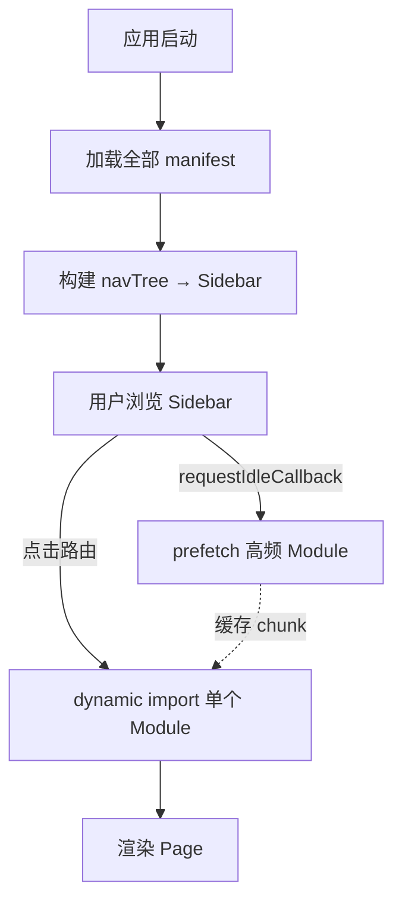
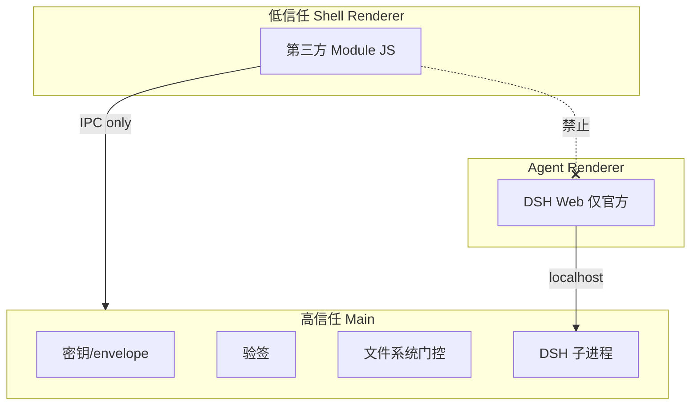

# 03 · 性能评估与安全调优

> 目标：Module 从 12 个扩到 50/100+ 时怎么保持快；安全边界怎么守。

---

## 1. 性能核心结论（先看这个）

| 误解 | 事实 |
|------|------|
| 12 个 Module = 12 倍启动 JS | 启动只读 **manifest 元数据**，不加载页面 JS |
| Sidebar 100 项 = 100 个 bundle 同时加载 | 仅 **当前路由** `dynamic import` 一个 chunk |
| Registry 驱动一定慢 | 100 条 manifest 合计约 **200KB**(冷缓存读盘解析待实测,见 §3 基准脚本),构建 navTree < 50ms |

**慢的来源通常是**：首屏同步 import 所有页面、Module 重复打包 React、ffmpeg 跑在 Renderer、未做 chunk 缓存。

---

## 2. 加载分层模型

```text
L0  manifest 元数据     启动时全量加载（轻）
L1  navTree 索引        启动时构建（轻）
L2  Module JS chunk     路由命中时才 dynamic import（重）
L3  prefetch            空闲时预取高频 Module（可选）
L4  卸载                内存压力时 drop chunk 缓存（可选）
```



---

## 3. 启动性能 SLO（建议）

| 指标 | 目标 | 测量方式 |
|------|------|----------|
| 冷启动 → 加载动画出现 | < 1s | exe 双击到首帧 |
| 加载动画结束 → 「点击进入」可点 | < 3s | Registry 扫描 + DSH 预热完成（后端不可达时降级进入，不无限等待） |
| 登录提交 → 进入工作台首页 | < 1.5s | 含 `#overview` 首屏渲染 |
| 首次进入某 Module | < 500ms | chunk 未 prefetch |
| 再次进入已访问 Module | < 100ms | chunk 已缓存 |
| Registry 热更新（装新 Module） | < 300ms | 不重启 Shell |
| Agent 窗口首次打开 | < 1.5s | DSH 已常驻 |

### 基准测试脚本（待实现）

```typescript
// scripts/bench-registry.ts（示意）
const manifests = generateMockManifests(100);
console.time('registry-build');
const tree = buildNavTree(manifests);
console.timeEnd('registry-build');  // 目标 < 50ms，实测前为估算值
```

---

## 4. Module 规模化：Sidebar 策略

当导航项 **> 20** 时启用：

| 策略 | 实现 |
|------|------|
| **分组折叠** | 默认只展开含 activeRoute 的组 |
| **搜索** | 顶部 filter，fuse.js 搜 name/id |
| **虚拟列表** | `@tanstack/react-virtual`，组内 >15 项时启用 |
| **最近使用** | localStorage 存最近 5 个 route，置顶区展示 |
| **租户白名单** | 后端 catalog 未授权 Module 不进 navTree |

```typescript
// 虚拟列表示意
function NavGroupItems({ items, activeRoute }: Props) {
  const virtualizer = useVirtualizer({
    count: items.length,
    getScrollElement: () => scrollRef.current,
    estimateSize: () => 36,
  });
  // ...
}
```

---

## 5. 代码分包与构建

### 5.1 目标 chunk 结构

```text
shell-[hash].js           ~150KB  壳 + TopBar/Sidebar + Router（常驻）
boot-[hash].js            加载动画 + 登录页（进主工作台后可丢弃）
module-home-[hash].js     按需
module-topic-pool-[hash].js
module-video-clipper-[hash].js   ❌ 短视频剪辑 Module（**待讨论**，暂不排期；若做则含 timeline 重组件）
vendor-react-[hash].js    共享单例
```

### 5.2 Vite 配置要点

```typescript
// apps/shell/vite.config.ts（示意）
export default defineConfig({
  build: {
    rollupOptions: {
      output: {
        manualChunks: {
          'vendor-react': ['react', 'react-dom'],
        },
      },
    },
  },
  optimizeDeps: {
    exclude: ['@no996/modules/*'],  // Module 独立 build
  },
});
```

### 5.3 Module 独立 build

每个 Module **单独** `vite build --lib`，externals：

```typescript
// modules/topic-pool/vite.config.ts
export default defineConfig({
  build: {
    lib: {
      entry: 'src/index.ts',
      formats: ['es'],
      fileName: 'index',
    },
    rollupOptions: {
      external: ['react', 'react-dom', '@no996/module-sdk'],
    },
  },
});
```

**禁止**每个 Module 打包一份 React（否则 12 Module = 12 份 React ≈ 启动/体积灾难）。

### 5.4 交付包现状与优化

当前工作台 `npm run build:web` 提示 **单入口 > 500KB**。迁移 Module 后：

- 每页独立 chunk → 首屏只加载 shell + 当前 Module
- 首页 `home` 保持轻量；重依赖组件（如 V2 剪辑 timeline）按 Module 拆分
- 新 UI 一律用 `web/admin` 的 shadcn/ui 组件体系重组（见 README 决策），交付包旧组件不复用

---

## 6. 运行时内存

| 场景 | 策略 |
|------|------|
| 离开 Module | `onDeactivate()` 清 timer / subscription / 大数组 |
| 大列表 | 虚拟滚动，不全量进 state |
| 视频/媒体预览 | 流式；原片不进 React state（V1 无视频 Module，该规则随剪辑 ❌ 待讨论项生效） |
| ffmpeg / 重计算 | **禁止 Renderer**；走 `shell.media.transcode` → Main/DSH tool（❌ 待讨论，暂不排期） |
| Agent 窗口 | 可最小化；DSH 子进程单例，勿重复 spawn |

```typescript
// Module 生命周期
export const TopicPoolModule: No996Module = {
  id: 'topic-pool',
  routes: [...],
  Page: TopicPoolPage,
  onDeactivate() {
    topicPoolStore.reset();  // 释放大列表
  },
};
```

---

## 7. 网络与 prefetch

```typescript
// apps/shell/src/prefetch.ts
const HIGH_FREQ = ['#overview', '#topic-pool', '#content-creation'];

export function prefetchHighFreqModules(registry: ModuleRecord[]) {
  requestIdleCallback(() => {
    for (const route of HIGH_FREQ) {
      const rec = matchRoute(registry, route);
      if (rec) import(/* @vite-ignore */ rec.entryUrl);
    }
  });
}
```

后端 API：Module 页内用 `shell.api.*`（Main 代理 + 连接复用），避免 Renderer 直连多域。

---

## 8. OTA 性能

| 阶段 | 策略 |
|------|------|
| 检查更新 | 启动后 **延迟 5s** 后台拉 catalog，不挡首屏 |
| 下载 | 后台 staging/；断点续传 |
| 切换 | 原子 rename；失败回滚 `.backup/` |
| Registry 刷新 | 增量 diff navTree；仅 Sidebar re-render |

---

## 9. 安全架构

### 9.1 信任边界



### 9.2 Electron 硬配置

```typescript
// BrowserWindow webPreferences（Shell + Agent 均适用）
{
  nodeIntegration: false,
  contextIsolation: true,
  sandbox: true,
  webSecurity: true,
}
```

### 9.3 CSP（Shell Renderer）

```text
default-src 'self';
script-src 'self';
style-src 'self' 'unsafe-inline';
connect-src 'self' https://api.no996.dev;
img-src 'self' data: blob:;
```

Module 额外域名须在 manifest `permissions` 声明，**租户管理员审批** 后 Main 才加入 connect-src。

---

## 10. Module 安全

### 10.1 签名与安装

```text
发布者私钥 → 签 manifest + dist 文件 hash 树 → .signature
App 内嵌公钥 → Main 加载前验签 → 失败拒绝
```

```typescript
// Main 验签示意
function verifyModule(rootPath: string): boolean {
  const manifest = readManifest(rootPath);
  const sig = readSignature(rootPath);
  const hashTree = hashDistFiles(rootPath);
  return ed25519.verify(sig, hashTree, EMBEDDED_PUBLIC_KEY);
}
```

| 环境 | 策略 |
|------|------|
| 生产 | 无签名 → 拒绝 |
| 开发 | `--allow-unsigned-modules` |

### 10.2 Permission 门控

manifest 声明 → Main **强制执行**：

```typescript
async function handleIpc(channel: string, moduleId: string, ...args: unknown[]) {
  const perms = registry.get(moduleId)?.manifest.permissions ?? [];
  if (!channelAllowed(channel, perms)) {
    auditLog('PERMISSION_DENIED', { moduleId, channel });
    throw new Error('PERMISSION_DENIED');
  }
  // ...
}
```

| Permission | 含义 |
|------------|------|
| `network:api.no996.dev` | `shell.api.*` |
| `filesystem:workspace:read` | 读 workspace 内 |
| `filesystem:workspace:write` | 写 workspace 内 |
| `agent:invoke` | `shell.agent.run` |
| `media:read` / `media:write` | 媒体文件 |
| `network:*` | 额外域（需审批） |

### 10.3 密钥与 Token

| 数据 | 存放 | Module 能否访问 |
|------|------|-----------------|
| refresh token | Main secure storage | **否** |
| access token | Main 按需签发短期 | 经 `getAccessToken()` 短期 |
| apiKey / envelope 明文 | Main 内存 | **否** |
| 用户 JWT payload | Session | 只读 displayName 等 |

### 10.4 Agent 窗口隔离

- 第三方 Module **不得** 在 Agent 窗口注入脚本
- Agent 窗口只加载 `127.0.0.1:DSH_PORT`
- Skill 是 **Markdown 指令**，不是可执行 JS；DSH 侧对 Skill 触发的工具/命令调用保留独立审批（自建，实现落地后补充机制细节）

---

## 11. 调优检查清单

### 启动慢

- [ ] `main.tsx` 是否仍静态 import 全部页面？→ 改 lazy
- [ ] 加载动画期间是否同步等待后端/OTA？→ 失败降级，不阻塞「点击进入」
- [ ] Module 是否各自打包 React？→ externals
- [ ] DSH 是否重复 spawn？→ 单例 + health check
- [ ] OTA 检查是否阻塞首屏？→ 延迟后台

### 切换 Module 慢

- [ ] chunk 是否过大（>1MB）？→ 拆组件、动态 import 重组件
- [ ] 是否未 prefetch 高频页？
- [ ] `onDeactivate` 是否泄漏 listener？

### Sidebar 卡顿

- [ ] 导航 >20 是否启用虚拟列表？
- [ ] navTree 是否每次 render 全量 sort？→ memoize

### 内存涨

- [ ] 视频/大文件是否进 React state？
- [ ] ffmpeg 是否在 Renderer？→ 移到 Main/DSH tool

### 安全

- [ ] 未签名 Module 能否加载？
- [ ] Renderer DevTools 能否看到 apiKey？
- [ ] Module 无 `agent:invoke` 能否调 agent？
- [ ] 被入侵的 LLM 生成内容能否借 Skill 指令诱导 DSH 执行危险工具？（prompt injection 防线在工具审批层）

---

## 12. Module 数量治理（软上限）

> ponytail: 免费额度 N 取值、默认 disabled 的开启者(租户管理员或平台运营)、V2 组内 manifest 懒加载触发条件均为开放决策,实现时定。

| 机制 | 说明 |
|------|------|
| 租户配额 | 免费 N 个启用 Module;企业按需 |
| 默认 disabled | OTA 新 Module 需管理员启用才进 nav |
| 官方 builtin | `builtin: true` 永远 L0,与第三方分离 |
| 分组延迟加载 | 折叠组内 manifest 可按组 lazy fetch(V2) |

**100+ Module 可行**，前提是：manifest 轻量、路由 lazy、Sidebar 虚拟化、租户白名单控可见数。

---

## 13. 监控指标（上线后）

| 指标 | 告警阈值 |
|------|----------|
| `app.cold_start_ms` | > 3000 |
| `boot.click_enter_ready_ms` | > 5000（加载动画结束到「点击进入」可点） |
| `auth.login_to_workspace_ms` | > 2000 |
| `module.first_load_ms` | p95 > 800 |
| `registry.scan_ms` | > 200 |
| `dsh.process.memory_mb` | > 1024 |
| `ipc.permission_denied` | 突增 |
| `module.signature_failed` | > 0 |

---

## 14. 与文档 01/02 的衔接

- 认知与角色 → [01-整体认知与上手指南](./01-整体认知与上手指南.md)
- 时序与 Bridge → [02-架构实现与调用链路](./02-架构实现与调用链路.md)

**给评审 AI 的重点**：本文 SLO 是否可测、permission 表是否完整、100 Module 场景是否覆盖。
